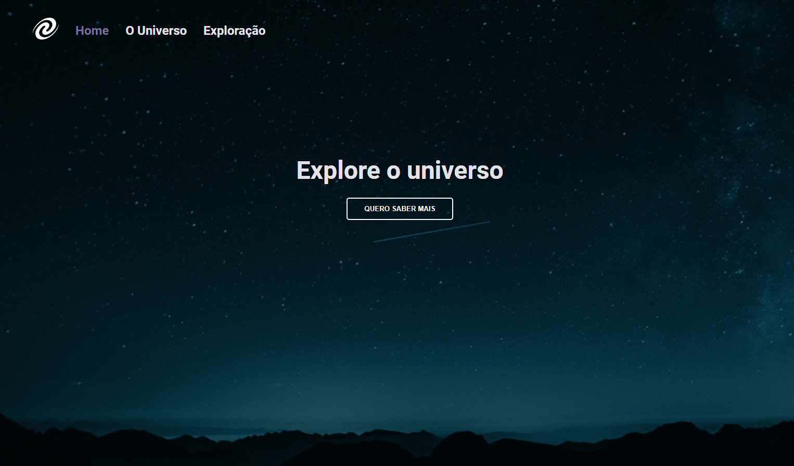

# Spa Universe

- Projeto feito durante o estágio 6 do explorer 
- Utilização de HTML, CSS E Javascript 

- Estrutura de dados HTML
- Funções no Javascript
- Manipulação da DOM
- ES6 Modules
- Refatoração
- Conceitos de SPA (Single page aplication)
- Routes
- Promisses
- Orientação a objetos

Deploy: [Clique aqui](https://spauniverse-ebon.vercel.app/)

Preview: 

